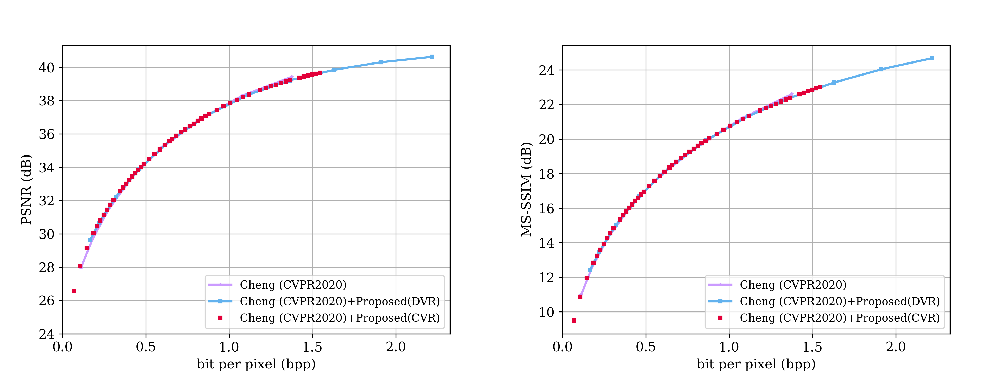

# QVRF: A QUANTIZATION-ERROR-AWARE VARIABLE RATE FRAMEWORK FOR LEARNED IMAGE COMPRESSION

Official implementation of "QVRF: A QUANTIZATION-ERROR-AWARE VARIABLE RATE FRAMEWORK FOR LEARNED IMAGE COMPRESSION"

## Table of Contents
- [Environment](#Environment)
- [Dataset](#Dataset)
- [Inference](#Inference)
- [RD Results](#RD Results)

# Environment
Recommend using Miniconda.
```
    #python>=3.6 should be fine.
    conda create -n qraf python=3.8
    conda activate qraf
    pip install compressai==1.1.5
    #pip install compressai==1.1.5 -i https://pypi.mirrors.ustc.edu.cn/simple/
 ```  
# Dataset
```
   mkdir dataset
   mv Kodak ./dataset
```
Download [Collection of Kodak](https://drive.google.com/file/d/1Fst3a0naKWx28zX--kDB5G_T6Kyec9R6/view?usp=sharing)
or [Kodak](http://r0k.us/graphics/kodak/) for Testing.

# Training
Using Trainningdataset_Preprocessing.py to select the largest 8000 images from [imageNet](http://www.image-net.org/challenges/LSVRC/2012/dd31405981ef5f776aa17412e1f0c112/ILSVRC2012_img_train.tar) and 584 images from [CLIC2020](https://data.vision.ee.ethz.ch/cvl/clic/professional_train_2020.zip) and to preprocess the images as the training dataset.
## Parameters
- `dataset`: dir. "Directory of training and validation dataset."

- `epochs`: int, default `1000` "Number of epochs"

- `learning-rate`: float, default `1e-4` "Learning rate."

- `num-workers`: int, default `4` "Dataloaders threads"

- `batch-size`: int, default `16` "Batch size"

- `test-batch-size`: int, default `64` "Test batch size"

- `learning-rate`: float, default `1e-4` "Learning rate."

- `patch-size`: int,  default `256 256` "Size of the patches to be cropped."

- `cuda`: "Use cuda."

- `save`: "Save model to disk."

- `seed`:  float, default `1926` "Set random seed for reproducibility"

- `clip_max_norm`:  float, default `1.0` "Set random seed for reproducibility"

- `checkpoint`: str, "Checkpoint path."

- `stage`: int,  default `1` "Trainning stage."

- `ste`: int,  default `0` "Using ste round in the finetune stage"

- `loadFromPretrainedSinglemodel`: int,  default `0` "Load fixed-rate model "

- `refresh`: int,  default `0` "Refresh the setting of optimizer and epoch"

## training Stage1
```
python3 train.py -d ./dataset  -e 2000 -lr 1e-4 -n 8 --batch-size 8 --test-batch-size 64 --aux-learning-rate 1e-3 --patch-size 256 256 --cuda --save --seed 1926 --clip_max_norm 1.0  --stage 1 --ste 0  --loadFromPretrainedSinglemodel 0 
```
## training Stage2
```
python3 train.py  -d ./dataset  -e 500 -lr 1e-4 -n 8 --batch-size 8 --test-batch-size 64 --aux-learning-rate 1e-3 --patch-size 256 256 --cuda --save --seed 1926 --clip_max_norm 1.0  --stage 2 --ste 0  --refresh 1 --loadFromPretrainedSinglemodel 0 --checkpoint checkpoint_best_loss.pth.tar |tee Cheng2020Noise.txt
```
Actually, you can load a fixed-rate model and finetune it with QVRF.
```
python3 train.py  -d ./dataset  -e 500 -lr 1e-4 -n 8 --batch-size 8 --test-batch-size 64 --aux-learning-rate 1e-3 --patch-size 256 256 --cuda --save --seed 1926 --clip_max_norm 1.0  --stage 2 --ste 0  --refresh 1 --loadFromPretrainedSinglemodel 1 --checkpoint cheng2020_attn-mse-6-730501f2.pth.tar |tee Cheng2020Noise.txt
```
## training Stage3
```
python3 train.py  -d ./dataset  -e 500 -lr 1e-4 -n 8 --batch-size 8 --test-batch-size 64 --aux-learning-rate 1e-3 --patch-size 256 256 --cuda --save --seed 1926 --clip_max_norm 1.0  --stage 3 --ste 1 --refresh 1 --loadFromPretrainedSinglemodel 0 --checkpoint checkpoint_best_loss.pth.tar |tee Cheng2020STE.txt
```
# Update
Once the model is trained, we need to run update.py to fix the entropy model

- `name`: str, "Exported model name"

- `dir`: str, "Exported model directory."
```commandline
python3 update.py checkpoint_best_loss.pth.tar   -n Cheng2020VR
```
# Inference
Download checkpoint  [variable rate model of Cheng2020](https://drive.google.com/file/d/1aydW2y2yohjD-cfcQKZv-SIO_FhDF4M-/view?usp=sharing) for Inference.
## Parameters
- `dataset`: str, "Test dataset path."

- `s`: int, default `2` "Discrete bitrate index."

- `output_path`: str, "The name of reconstructed dir."

- `p`: str, "Checkpoint path."

- `patch`: int, default `64`. "Padding size."

- `factormode`: int, between `[0, 1]`, default `0`. "Whether to choose continuous bitrate adaption."

- `factor`: float between `[0.5, 12]`, default `1.5`.  "Reciprocal of continuous bitrate quantization bin size."

## Inference code
```
    python3 Inference.py --dataset TestDataset --s 2 --output_path output_pathName -p CheckpointPath --patch 64 --factormode 1 --factor 0.1
```

## Example of Inference.py
### Discrete bitrate results
For all discrete bitrate results:
```
    python3 Inference.py --dataset ./dataset/Kodak --s 8 --output_path AttentionVRSTE -p ./Cheng2020VR.pth.tar --patch 64 --factormode 0 --factor 0
```
For  discrete bitrate results at a assign Index: Index belongs in {0, 1, 2, 3, 4, 5, 6, 7}
```
    python3 Inference.py --dataset ./dataset/Kodak --s Index --output_path AttentionVRSTE -p ./Cheng2020VR.pth.tar --patch 64 --factormode 0 --factor 0
```
### Continuous bitrate results
For example continuous bitrate  results:
```
    python3 Inference.py --dataset ./dataset/Kodak --s 2 --output_path AttentionVRSTE -p ./Cheng2020VR.pth.tar --patch 64 --factormode 1 --factor 0.1
```
Change arbitrary quantization bin size in the range of [0.5, 12] at a quantization bin size 1/QBS.  (1/QBS in range of [0.5, 12])
```
    python3 Inference.py --dataset ./dataset/Kodak --s 2 --output_path AttentionVRSTE -p ./Cheng2020VR.pth.tar --patch 64 --factormode 1 --factor 1/QBS
```
### Note
A higher bitrate corresponds to a larger factor value which is the  reciprocal of quantization bin size.

## Discrete/Continuous Variable Rate Results

## Note
From public code and paper, the models of Cheng2020 only trained for the low and medium rate with lambda belonging to {0.0016, 0.0032, 0.0075, 0.015, 0.03, 0.045}. 

We re-trained Cheng2020 on our training dataset following the original paper setting with lambda belonging to {0.0018, 0.0035, 0.0067, 0.0130, 0.0250, 0.0483, 0.0932, 0.1800} for a fair comparison.
## Improvement of QVRF
Using the predefined Lagrange multiplier set  {0.0018, 0.0035, 0.0067, 0.0130, 0.025, 0.0483, 0.0932, 0.18, 0.36, 0.72, 1.44} with  can achieve better results in high bitrate.


You can download the [checkpoint](https://drive.google.com/file/d/1jMJxvT-YFJ8L3W-mx4-yjBz72MfgMC3e/view?usp=sharing) for testing the result with the predefined Lagrange multiplier set  {0.0018, 0.0035, 0.0067, 0.0130, 0.025, 0.0483, 0.0932, 0.18, 0.36, 0.72, 1.44}.
# RD Results
We used the 8 pretrained discrete models for Balle et al., Minnen et al. from [compressai](https://github.com/InterDigitalInc/CompressAI) as the benchmark.

We re-trained 8 Cheng2020 models on our training dataset from low bitrate and high bitrate (all the models use channel numbers of 192 for comparison).
## RD Curve On Kodak dataset with 24 images
### Comparison of variable rate methods. The baseline is Balle and use 8 fix-rate models as anchor

### Comparison of variable rate methods.The baseline is Minnen and use 8 fix-rate models as anchor

### Comparison of variable rate methods.The baseline is Cheng2020 and use 8 fix-rate models as anchor


