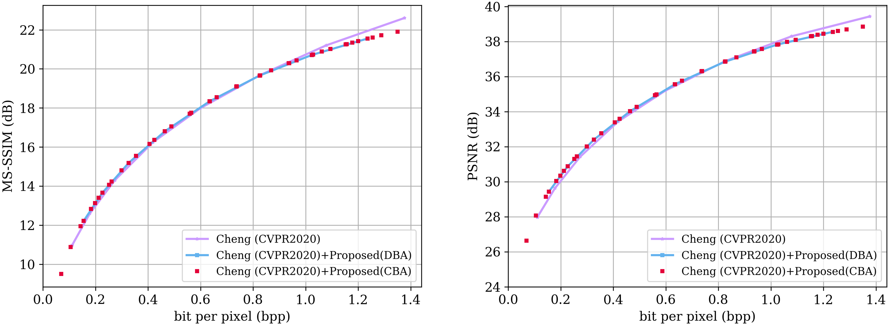
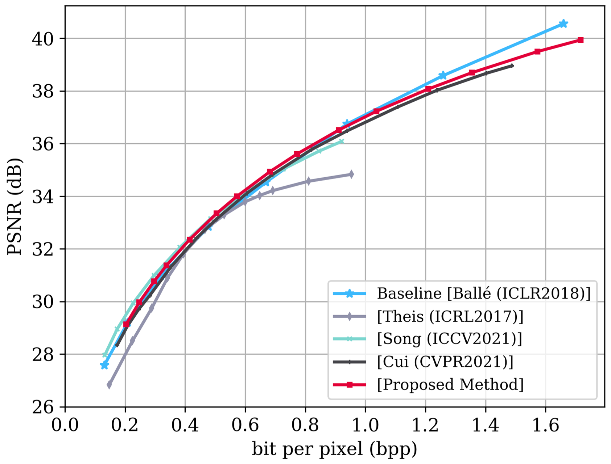
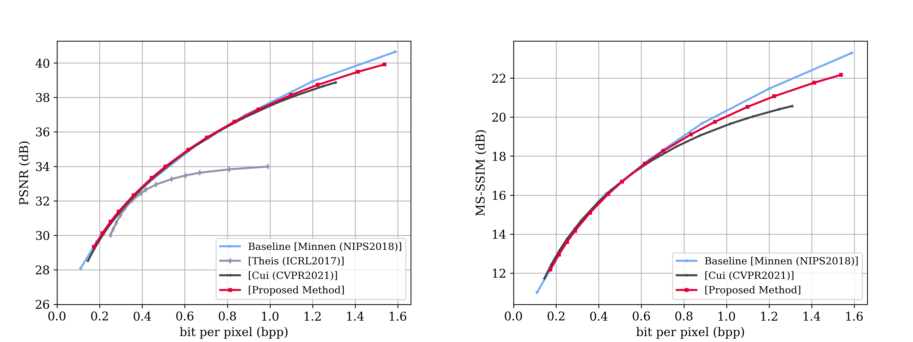
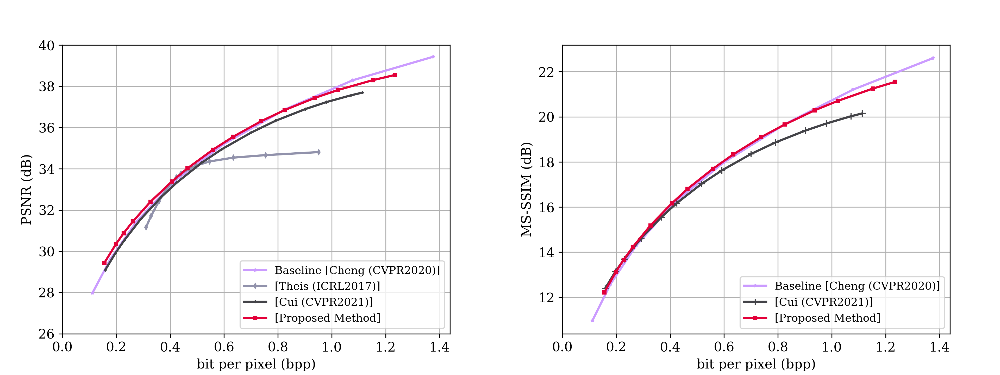

# QRAF: A QUANTIZATION-ERROR-AWARE RATE ADAPTION FRAMEWORK FOR LEARNED IMAGE COMPRESSION
Official implementation of "QRAF: a Quantization-error-aware Rate Adaption Framework for Learned Image Compression"

## Table of Contents
- [Environment](#Environment)
- [Dataset](#Dataset)
- [Inference](#Inference)
- [RD Results](#RD Results)

# Environment
Recommend using Miniconda.
```
    #python>=3.6 should be fine.
    conda create -n qraf python=3.8
    conda activate qraf
    pip install compressai==1.1.5
    #pip install compressai==1.1.5 -i https://pypi.mirrors.ustc.edu.cn/simple/
 ```  
# Dataset
```
   mkdir dataset
   mv Kodak ./dataset
```
Download [Collection of Kodak](https://drive.google.com/file/d/1Fst3a0naKWx28zX--kDB5G_T6Kyec9R6/view?usp=sharing)
or [Kodak](http://r0k.us/graphics/kodak/) for Testing.
# Inference
Download checkpoint  [variable rate model of Cheng2020](https://drive.google.com/file/d/1aydW2y2yohjD-cfcQKZv-SIO_FhDF4M-/view?usp=sharing) for Inference.
## Parameters
- `dataset`: dir. "Test dataset path."

- `s`: int, default `2` "Discrete bitrate index."

- `output_path`: str, "The name of reconstructed dir."

- `p`: str, "Checkpoint path."

- `patch`: int, default `64`. "Padding size."

- `factormode`: int, between `[0, 1]`, default `0`. "Whether to choose continuous bitrate adaption."

- `factor`: float between `[0.5, 12]`, default `1.5`.  "Reciprocal of continuous bitrate quantization bin size."

## Inference code
```
    python3 Inference.py --dataset ./dataset/Kodak --s 2 --output_path AttentionVRSTE -p ./Cheng2020VR.pth.tar --patch 64 --factormode 1 --factor 0.1
```

## Example of Inference.py
### Discrete bitrate results
```
    python3 Inference.py --dataset ./dataset/Kodak --s 2 --output_path AttentionVRSTE -p ./Cheng2020VR.pth.tar --patch 64 --factormode 0 --factor 0
```
### Continuous bitrate results
Change quantization bin size of the list in the range of [0.5, 12] at a quantization bin size 1/QBS at the line 381 in Inference.py.  (1/QBS in range of [0.5, 12])
```
    python3 Inference.py --dataset ./dataset/Kodak --s 2 --output_path AttentionVRSTE -p ./Cheng2020VR.pth.tar --patch 64 --factormode 1 --factor 0.1
```
## Note
A higher bitrate corresponds to a larger factor value which is the  reciprocal of quantization bin size.

## Discrete/Continuous Bitrate Adaption Results
.

# Variable RD Results
We used the 8 pretrained discrete models for Balle et al., Minnen et al. from [compressai](https://github.com/InterDigitalInc/CompressAI) as the benchmark.

We re-trained 8 Cheng2020 models on our training dataset from low bitrate and high bitrate.
## RD Curve On Kodak dataset with 24 images
### Variable rate of Balle
.
### Variable rate of Minnen
.
### Variable rate of Cheng2020
.

##Note
From public code and paper, the models of Cheng2020 only trained for the low and medium rate with lambda belonging to {0.0016, 0.0032, 0.0075, 0.015, 0.03, 0.045}. 

We re-trained Cheng2020 on our training dataset following the original paper setting with lambda belonging to {0.0018, 0.0035, 0.0067, 0.0130, 0.0250, 0.0483, 0.0932, 0.1800} for a fair comparison.